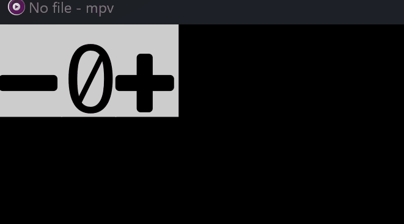

## dev
bash
```bash
pnpm i

export MPV_SCRIPT_DIR=/your_mpv_dir/portable_config/scripts && pnpm run dev
```

fish
```fish
pnpm i

set -x MPV_SCRIPT_DIR /your_mpv_dir/portable_config/scripts ; pnpm run dev
```

## counter-ui

